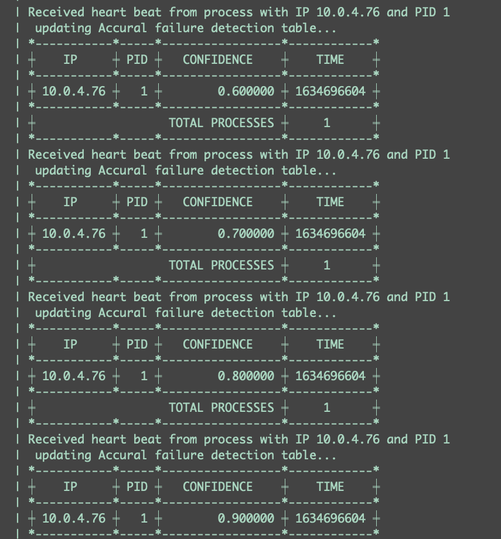

# Phi Accural Failure Detection 


## Run leader
```
go run leader.go
```

## Run followers
```
go run follwer.go
```

## Run with Docker 
There is a docker compose file to run the different services. 
A local docker registry on port `5001` so that the different nodes in the swarm can share images.
Tools used: `Docker Compose`, `Docker Stack` and `Docker Swarm`